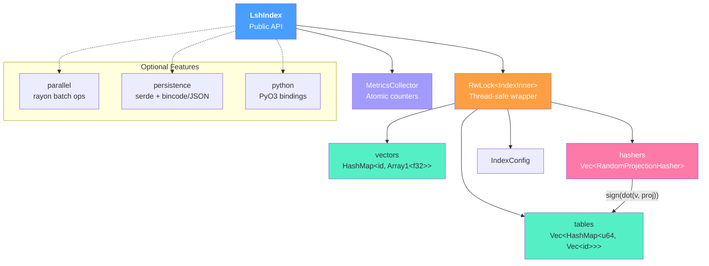
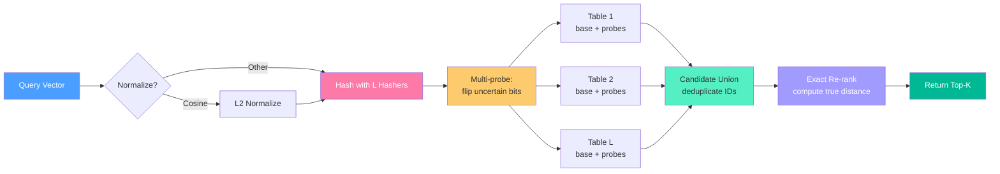
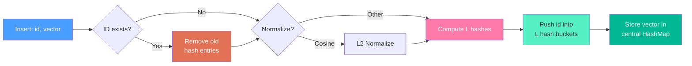

# superbit

A lightweight, in-memory vector index for approximate nearest-neighbor (ANN) search using Locality-Sensitive Hashing.

[](https://crates.io/crates/superbit_lsh)
[](https://docs.rs/superbit_lsh)
[](https://github.com/kunalsinghdadhwal/superbit)

## Overview

`superbit` provides fast approximate nearest-neighbor search over
high-dimensional vectors without the operational overhead of a full vector
database. It implements **random hyperplane LSH** (SimHash), a
locality-sensitive hashing scheme that hashes similar vectors into the same
buckets with high probability. Candidate vectors retrieved from the hash
tables are then re-ranked with an exact distance computation, giving a good
balance between speed and recall.

**Target use cases:**

- Retrieval-augmented generation (RAG) prototyping
- Recommendation system experiments
- Embedding similarity search during development
- Anywhere you need sub-linear ANN queries and want to avoid external
  infrastructure

## Features

- **Random hyperplane LSH (SimHash)** for cosine, Euclidean, and dot-product
  similarity
- **Multi-probe querying** -- probe neighboring hash buckets to improve recall
  without adding more tables
- **Thread-safe concurrent access** via `parking_lot::RwLock` (parallel reads,
  exclusive writes)
- **Builder pattern** for ergonomic index configuration
- **Auto-tuning** -- `suggest_params` recommends `num_hashes`, `num_tables`,
  and `num_probes` given a target recall and dataset size
- **Runtime metrics** -- lock-free atomic counters track query latency,
  candidate counts, and bucket hit rates
- **Optional features:**
  - `parallel` -- parallel bulk insert and batch query via rayon
  - `persistence` -- save/load indexes to disk with serde + bincode (or JSON)
  - `python` -- Python bindings via PyO3

## Architecture

### Module Structure



### Query Flow



### Insert Flow



## Quick Start

Add the crate to your `Cargo.toml`:

```toml
[dependencies]
superbit_lsh = "0.1"
```

Build an index, insert vectors, and query:

```rust
use superbit::{LshIndex, DistanceMetric};

fn main() -> superbit::Result<()> {
    // Build a 128-dimensional index with cosine similarity.
    let index = LshIndex::builder()
        .dim(128)
        .num_hashes(8)
        .num_tables(16)
        .num_probes(3)
        .distance_metric(DistanceMetric::Cosine)
        .seed(42)
        .build()?;

    // Insert vectors (ID, slice).
    let v = vec![0.1_f32; 128];
    index.insert(0, &v)?;

    let v2 = vec![0.2_f32; 128];
    index.insert(1, &v2)?;

    // Query for the 5 nearest neighbors.
    let results = index.query(&v, 5)?;
    for r in &results {
        println!("id={} distance={:.4}", r.id, r.distance);
    }

    Ok(())
}
```

## Feature Flags

| Flag          | Effect                                                      |
|---------------|-------------------------------------------------------------|
| `parallel`    | Parallel bulk insert and batch query via rayon              |
| `persistence` | Save/load index to disk (serde + bincode + JSON)            |
| `python`      | Python bindings via PyO3                                    |
| `full`        | Enables `parallel` + `persistence`                          |

Enable features in your `Cargo.toml`:

```toml
[dependencies]
superbit_lsh = { version = "0.1", features = ["full"] }
```

## Configuration Guide

The three main knobs that control the speed/recall/memory trade-off are:

| Parameter    | What it controls                                  | Higher value means                          |
|--------------|---------------------------------------------------|---------------------------------------------|
| `num_hashes` | Hash bits per table (1--64)                       | Fewer, more precise buckets; lower recall per table but less wasted work |
| `num_tables` | Number of independent hash tables                 | Better recall (more chances to find a neighbor); more memory |
| `num_probes` | Extra neighboring buckets probed per table        | Better recall without adding tables; slightly more query time |

**Rules of thumb:**

- Start with the defaults (`num_hashes=8`, `num_tables=16`, `num_probes=3`)
  and measure recall on a held-out set.
- If recall is too low, increase `num_tables` or `num_probes` first.
- If queries are too slow (too many candidates), increase `num_hashes` to make
  buckets more selective.
- For cosine similarity the index L2-normalizes vectors on insertion by default
  (`normalize_vectors=true`).

## Auto-Tuning

Use `suggest_params` to get a starting configuration based on your dataset size
and target recall:

```rust
use superbit::{suggest_params, DistanceMetric};

let params = suggest_params(
    0.90,                    // target recall
    100_000,                 // expected dataset size
    768,                     // vector dimensionality
    DistanceMetric::Cosine,  // distance metric
);

println!("Suggested: hashes={}, tables={}, probes={}, est. recall={:.2}",
    params.num_hashes, params.num_tables, params.num_probes, params.estimated_recall);
```

You can also estimate the recall of a specific configuration without building
an index:

```rust
use superbit::{estimate_recall, DistanceMetric};

let recall = estimate_recall(16, 8, 2, DistanceMetric::Cosine);
println!("Estimated recall: {:.2}", recall);
```

## Performance

LSH-based indexing provides **sub-linear query time** by reducing the search
space to a small set of candidate vectors. In practice:

- For datasets **under ~10,000 vectors**, brute-force linear scan is often fast
  enough and gives exact results. LSH adds overhead that may not pay off at
  this scale.
- For datasets **above ~10,000 vectors**, LSH becomes increasingly beneficial.
  Query time grows much more slowly than dataset size.
- With well-tuned parameters you can typically achieve **80--95% recall** while
  examining only a small fraction of the dataset.

The `parallel` feature flag enables rayon-based parallelism for bulk inserts
(`par_insert_batch`) and batch queries (`par_query_batch`), which can
significantly speed up workloads that operate on many vectors at once.

Use the built-in metrics collector (`.enable_metrics()` on the builder) to
monitor query latency, candidate counts, and bucket hit rates in production.

## Comparison with Other Rust ANN Crates

| Crate             | Algorithm       | Notes                                          |
|-------------------|-----------------|-------------------------------------------------|
| **superbit** | Random hyperplane LSH | Lightweight, pure Rust, no C/C++ deps. Good for prototyping and moderate-scale workloads. |
| usearch           | HNSW            | High performance, C++ core with Rust bindings. Better for large-scale production. |
| hora              | HNSW / IVF-PQ   | Pure Rust, multiple algorithms. More complex API. |
| hnsw_rs           | HNSW            | Pure Rust HNSW implementation.                 |

`superbit` is intentionally simple: a single algorithm, a small API
surface, and no native dependencies. It is a good fit for prototyping,
moderate-scale applications, and situations where you want to understand and
control the indexing behavior. For very large datasets (millions of vectors) or
when you need maximum throughput, a graph-based index like HNSW will generally
outperform LSH.

## License

Licensed under either of

- [Apache License, Version 2.0](LICENSE-APACHE)
- [MIT License](LICENSE-MIT)

at your option.
